# Next.js & HeroUI Template

This is a template for creating applications using Next.js 14 (app directory) and HeroUI (v2).

[Try it on CodeSandbox](https://githubbox.com/heroui-inc/heroui/next-app-template)

## Technologies Used

- [Next.js 14](https://nextjs.org/docs/getting-started)
- [HeroUI v2](https://heroui.com/)
- [Tailwind CSS](https://tailwindcss.com/)
- [Tailwind Variants](https://tailwind-variants.org)
- [TypeScript](https://www.typescriptlang.org/)
- [Framer Motion](https://www.framer.com/motion/)
- [next-themes](https://github.com/pacocoursey/next-themes)

## How to Use

### Use the template with create-next-app

To create a new project based on this template using `create-next-app`, run the following command:

```bash
npx create-next-app -e https://github.com/heroui-inc/next-app-template
```

### Install dependencies

You can use one of them `npm`, `yarn`, `pnpm`, `bun`, Example using `npm`:

```bash
npm install
```

### Run the development server

```bash
npm run dev
```

### Setup pnpm (optional)

If you are using `pnpm`, you need to add the following code to your `.npmrc` file:

```bash
public-hoist-pattern[]=*@heroui/*
```

After modifying the `.npmrc` file, you need to run `pnpm install` again to ensure that the dependencies are installed correctly.

## License

Licensed under the [MIT license](https://github.com/heroui-inc/next-app-template/blob/main/LICENSE).

# ThirdSpace 🌐

**ThirdSpace** is a next-generation social planning app designed to help real people make real plans in real life — no pressure, no noise, just a space to be you.

---

# VIDEO DEMOS:

[Google Drive](https://drive.google.com/drive/folders/1PXuyRo8X-e0AiXwJJtfpQM2DY0uiE85U?usp=sharing)

## 🚀 Tech Stack

- **Framework**: [Next.js 15](https://nextjs.org/)
- **Frontend**: [React 18](https://reactjs.org/), [Tailwind CSS](https://tailwindcss.com/)
- **UI Components**: [HeroUI](https://heroui.dev/) + custom animations
- **Backend**: Node.js / Express-like API routes
- **Database**: MongoDB (via native driver)
- **Auth**: Custom + OAuth social logins (Google, GitHub, more coming soon)

---

## 🔧 Local Development Setup

1. **Clone the repo**

   ```bash
   git clone https://github.com/your-username/thirdspace.git
   cd thirdspace

   ```

2. **Create env.local**
   MONGO_URI=<your-mongo-connection-string>
   NEXT_PUBLIC_BASE_URL=http://localhost:3000

3. **Run the dev server**

npm run dev

**📁 Folder Structure (Highlights)**

├── app/
│ ├── login/ → Login UI
│ ├── register/ → Multi-step registration form
│ ├── providers/ → Custom Toast + Theme providers
├── components/
│ ├── register-forms/ → Step components (Name, Email, etc.)
│ ├── navigation/ → Floating buttons
│ ├── background-animations/
├── utils/
│ ├── frontend-backend-connection/
│ └── handleRegisterUser.ts
├── lib/
│ └── mongodb.ts → MongoDB client setup

## 🧪 Coming Soon

- 🎊 Post-registration "Thank You" page with confetti

- 📆 User event feed with smart planning suggestions

- 📲 Native mobile build (React Native or Expo)

- 🧙 AI social assistant ("What should we do this weekend?")

## 🧠 Philosophy

    ThirdSpace isn't just another event app. It's the antidote to flaky plans, endless group chats, and social burnout. Think: what Facebook events were supposed to be... but cooler.

# ThirdSpace Feed System - README

This document outlines the architecture, functionality, and development progress of the feed system for the ThirdSpace app, including visual references.

## Overview

The ThirdSpace feed displays dynamic social activity from a user's network, including:

- Friend connections (e.g., friend_accepted)

- Event RSVPs (e.g., joined_event)

- Profile updates

- Events coming up near the user

It supports pagination and is being extended to include infinite scroll capabilities.

## Backend API

### Endpoint

```
GET /api/users/:id/user-feed?page=1&limit=10
```

- Merges two sub-feeds:

  - `generateUserFeed(user, friends, events)`

  - `generateEventFeed(user, events)`

- Sorts results by timestamp

- Returns paginated feed with metadata

### Example Feed Item

```
{
  "id": "688ead8b28802692f9b3ceb9",
  "actor": {
    "eventId": "6886d6cda4b15a3b7a5095a4",
    "eventName": "Dog petting ceremony",
    "location": {
      "name": "Dog petting ceremony",
      "lat": 27.9,
      "lng": -82.8
    },
    "totalAttendance": 0,
    "startingDate": "2025-08-05T00:00:00.000Z"
  },
  "target": {
    "eventId": "6886d6cda4b15a3b7a5095a4",
    "title": "Dog petting ceremony"
  },
  "type": "event_coming_up",
  "timestamp": "2025-08-05T00:00:00.000Z"
}
```

## Frontend Structure

### Feed Context

Provides feed data to the page:

```
const FeedContext = createContext<FeedContextType | undefined>(undefined);
```

- `items[]`: Feed data

- `loading`: Status

- `refresh()`: Manual refetch

### Main Feed Page

- Auth-protected via `useSession`

- Renders `GreetingHeader` and a list of `FeedItemCard`s

### FeedItemCard

- Handles all rendering logic based on feed `type`

- Dynamic layout depending on type: event, profile update, etc.

### FeedCardFooter

- Renders action/footer content depending on `type`

- Conditional block for `event_coming_up` uses `formatDistanceToNow()` for time

- Includes button linking to event detail page

## Screenshots

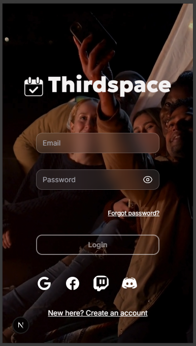

### Visual representation of the working feed system:


### Profile Update Card


### Joined Event Card


### Event Reminder with Time Header


### User Dropdown Menu


### Social‑Style Activity Feed (`SCRUM-44`)

- **Vertical Scroll Feed** --- Displays recent activities from a user's friends in a Twitter/Instagram‑style vertical scroll.

- **Supported Activity Types**:

  - Hosted events

  - Event RSVPs / attendance

  - Friend requests accepted

  - Profile updates (bio, avatar, location, username, tags, status)

  - Status posts with optional image attachments

- **Real‑Time Updates**:

  - `useSmartFeedRefresh` hook for periodic refresh

  - Displays a **"New Updates"** banner when fresh items are available

  - Merges new and existing items with `mergeFeedItems` to prevent duplicates

- **Responsive Card Design**:

  - `FeedItemCard` component with contextual actions per feed type

  - Type guards (`isEvent`) ensure correct rendering for event vs user activities

  - Mobile‑first, adaptive layout

- **Backend Support**:

  - `/user-feed` endpoint fetches persisted feed data from MongoDB

  - Feed generation functions (`generateUserFeed` / `generateEventFeed`)

  - Deduplication logic on insert to prevent redundant entries

  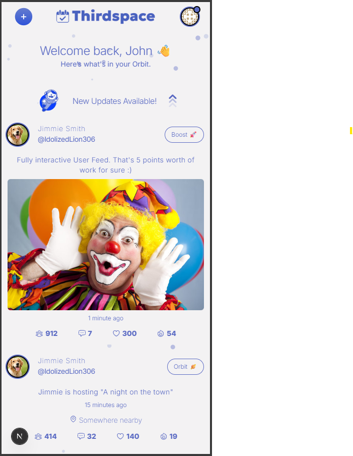
  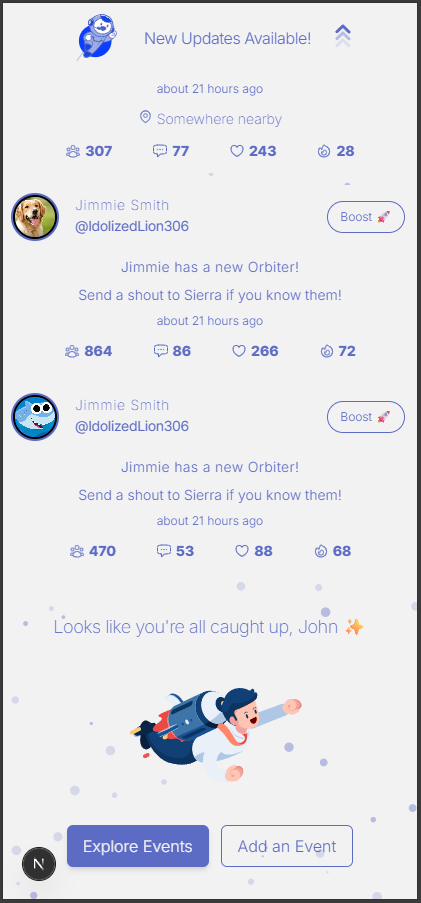

## 🚀 Current Status

- ✅ MVP in active development (August 2025)
- ✅ Backend architecture live with MongoDB, Express, and Next.js
- ✅ Frontend rewritten with TailwindCSS + HeroUI
- ✅ Auth + Smart Session Handling via NextAuth
- ✅ Feed system launched with deep real-time functionality

---

## 🔄 Recent Worklog (July–August 2025)

### 🎯 Status Feed Overhaul (`/feed`)

- ✅ Implemented `status_posted` and `profile_status_updated` feed item types
- ✅ Added logic for self-status visibility (users now see their own posts)
- ✅ Normalized `actor` and `target` structure across feed generators
- ✅ Added timestamp control for smart refreshes and delta-based updates

### 🪓 Data Debugging & Cleanup

- ✅ Discovered malformed feed targets (`ttile` typo, etc.)
- ✅ Wrote a nuke route (`DELETE /api/dev/wipe`) for quick dev resets
- ✅ Refactored `generateUserFeed()` to pull from MongoDB and reduce duplication

### 🐞 Bug Fixes (Big ones)

- 🧠 Fixed JSX bug where attachments were hidden inside a function block
- 🕳️ Tracked down silent fails in `status_posted` feed items due to shape mismatches
- ⚠️ Swiper CSS bugs (extra bottom bar, overflow) patched with deep Tailwind overrides
- ⏱️ Fixed Smart Refresh logic to actually respect timestamp deltas (60s)

### 🎨 Frontend UX

- ✅ SwiperJS integration for photo attachments (status + events)
- ✅ Responsive grid layout for multi-attachment feed cards
- ✅ Fallback for gravatar and username display
- ✅ Tooltips + accessibility cleanups

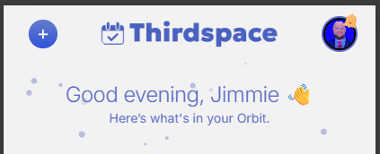
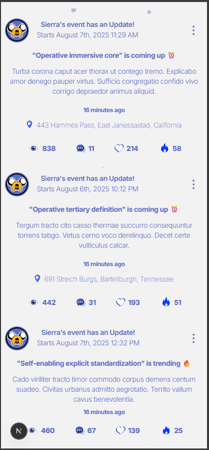
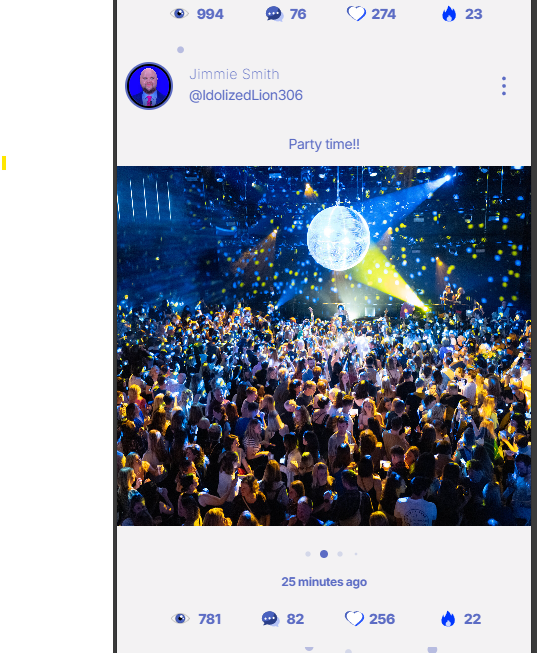
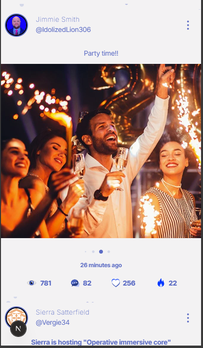
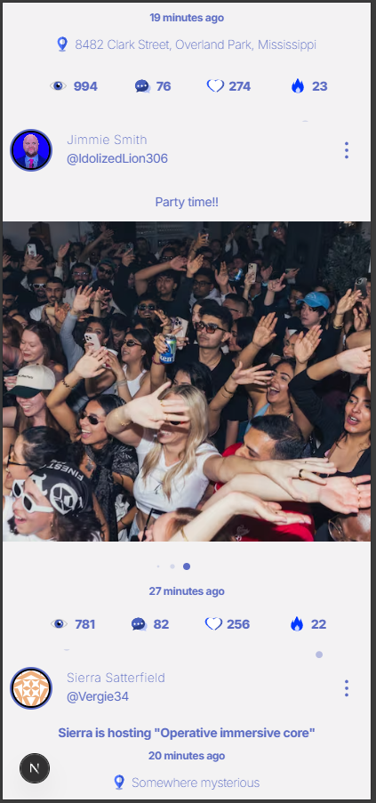

## 🆕 Recent Update — Location Attachments in Feed

We’ve added support for **location-based profile updates** with image attachments pulled from the **Unsplash API**.

### How it works

- When a user updates their **location** in their profile, the backend now queries Unsplash for a relevant photo based on the city/state string.
- The first result (if available) is attached to the **`profile_location_updated`** feed item.
- Photo credit metadata is stored alongside the attachment for attribution.
- If Unsplash is down or rate-limited, the feed item still posts without an attachment.

### Visibility rules

- Currently, all location updates appear in friends’ feeds.
- Future updates will incorporate **follower-based visibility** for public/private events and profile changes.

### Developer Notes

- **Frontend** displays these attachments inside the `AttachmentSwiper` component for a smooth swipe-through UI.
- **Backend** enforces type consistency:
  - Dates stored as `Date` objects server-side.
  - Strings for timestamps in API responses.
  - ObjectIds stored for relationships, cast to strings in responses.
- Code changes located in:
  - `PATCH /users/:id` (profile update logic)
  - `UserFeedDoc` model (`target.attachments` & `target.photoCredit`)
  - `AttachmentSwiper` component

## Recent Updates

### 🆕 Features

- **Sticky Mobile Footer Navigation**  
  Added a fixed footer nav bar for mobile view with quick access to:

  - Search
  - My Events
  - Settings
  - Back to Top
  - Direct Messages (DM)

- **Back to Top Floating Button**  
  Added a floating Back to Top button (Lottie animation) positioned bottom-right on main feed for quick scrolling. Tooltip on hover for clarity.

- **Primary-Color Switch Styling**  
  Updated theme toggle switch to retain primary brand background color in both on/off states, ensuring visual consistency.

### 🐛 Bug Fixes

- **Duplicate Feed Item Fix**  
  Fixed a race condition that caused duplicate `profile_location_updated` feed entries (one with Unsplash image, one without). Updates now guard against simultaneous PATCH requests and only insert feed items when a real change occurs.

- **Theme Reset to Light Mode**  
  Cleared persisted dark mode settings and enforced light theme as default to prevent unwanted style overrides on inputs/buttons.

  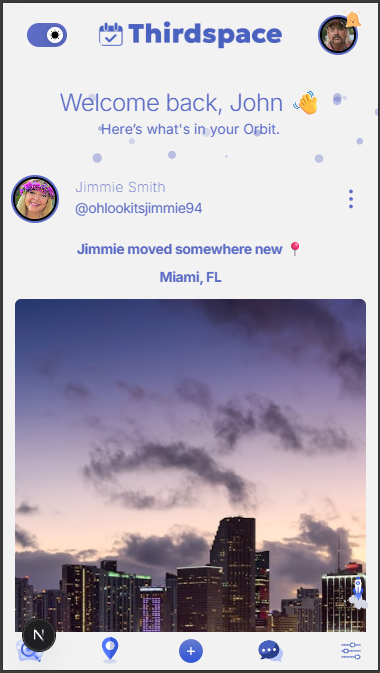
  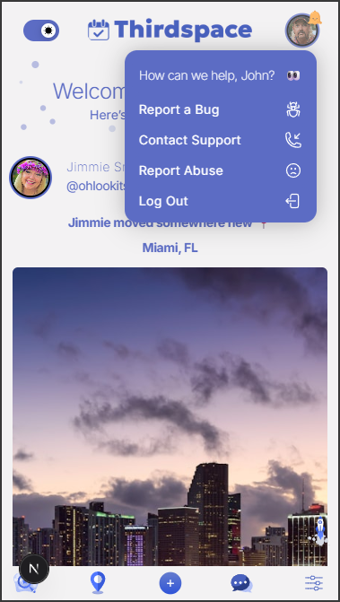
  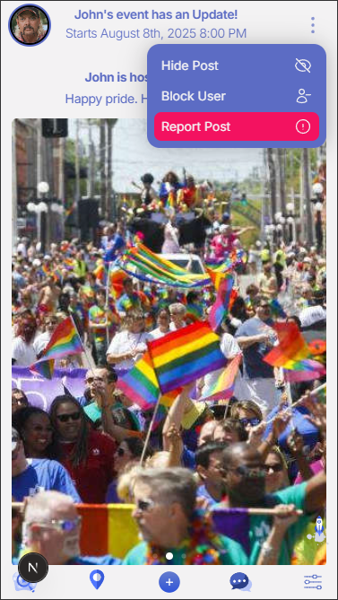
  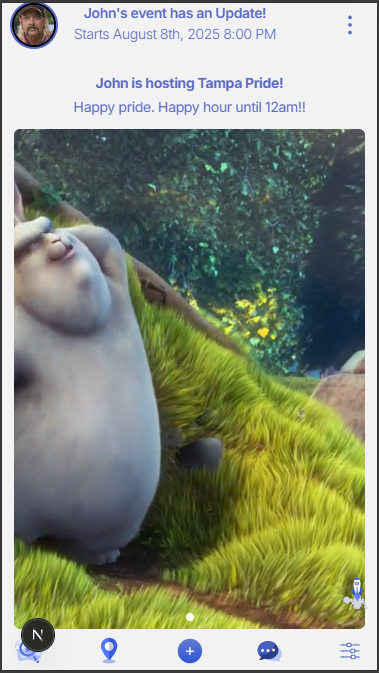

  # ThirdSpace

ThirdSpace is a low-pressure social coordination platform that helps friends, communities, and new connections find each other, meet up, and share events — all in real time.

---

## 🚀 Recent Updates (Aug 2025)

### Geospatial Features

- **Interactive Event Maps** — All events now display an embedded, zoomable map powered by MapLibre.
- **Nearby Events API** (`/api/users/:id/get-nearby-events`)
  - Finds events within a given radius of the user.
  - Uses MongoDB `$nearSphere` queries on a `2dsphere` index.
  - Stores coordinates as **GeoJSON Point** `[lng, lat]`.
- **Nearby Users API** (`/api/users/:id/get-nearby-users`)
  - Finds users within a radius that share overlapping tags.
  - Uses `$geoNear` for distance sorting and `$setIntersection` for tag matching.
  - Scores results by tag overlap (weighted) and proximity.
- **Indexes**:
  - `location.geo` (2dsphere) for both events and users.
  - `tags` for faster shared-interest matching.

### Data Improvements

- **Default Location Fallback** — If no coordinates are provided, system uses geocoding or a safe default.
- **AI Keyword Extraction** — Auto-generates tags from bios/interests for better nearby user matching.
- **Type Safety Fixes** — Resolved `number | undefined` issues for lat/lng props.

### UI Fixes

- **Footer Scroll Bug** — Footer hides when scrolling down. visible when when scrolling up (sticky + z-index fix).
- **Smart Refresh Click Target** — “New update available” banner now makes the entire banner clickable, not just the arrow.

---

## 📦 API Endpoints

### **Nearby Events**

Returns users within the radius that share at least `minShared` tags.

---

## ⚙️ Setup Notes

- Ensure MongoDB collections for `users` and `events` have `2dsphere` indexes on `location.geo`.
- Geocoding utilities require environment variable `BASE_URL` for reverse geocoding calls.

---

## 📅 Next Steps

- Add client-side UI for nearby user discovery.
- Improve AI tag extraction fallback and caching.
- Filter nearby events by user interests.

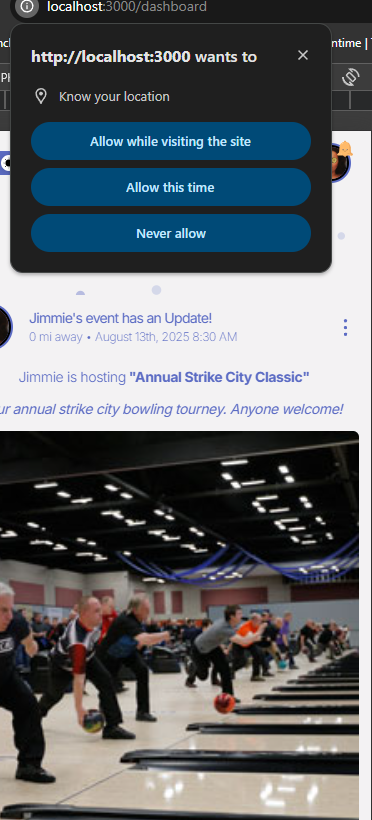
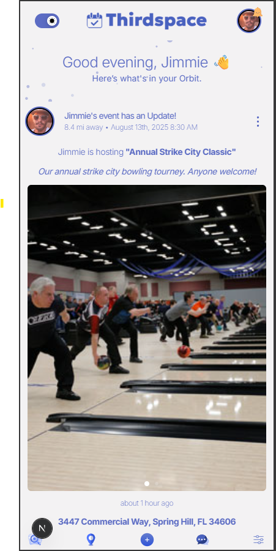
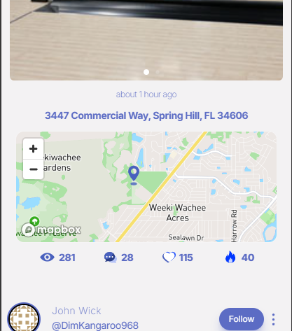

# 🕐 Sprint Worklog (52h) - End of sprint 1 - SCRUM 35

## Feed System Enhancements – 21h

- Implemented `generateUserFeed` with friend + self actor support (6h)
- Added distance calculations and geocoding fallback for events (3h)
- Normalized event attachments, snippets, and locations (2h)
- Added profile update feed types (`avatar`, `location`, `status`) (4h)
- Debugged unexpected logging of `username`, `bio`, `tags` updates and filtered them out via `PUBLIC_FEED_TYPES` allowlist (4h)
- Verified deduplication logic and confirmed persistence for admin/audit cases (2h)

## Frontend Feed UI – 10h

- Built out `FeedItemCard` display logic with actor/event type checks (3h)
- Fixed avatar fallback to Gravatar and ensured event vs user actors display correctly (2h)
- Implemented empty state handling and debug scaffolding (1h)
- Added quirky “Say Hi” button in place of snippet for new joins (2h)
- Brainstormed and designed “Spark” feature for karma/upvotes (2h)

## Profile & Settings – 8h

- Extended `ProfileSettingsModal` with bio, tags, and language updates (3h)
- Added character limit enforcement and live counter for bio (2h)
- Fixed text color / theming issues in `Textarea` (1h)
- Verified profile updates only log intended feed items (2h)

## Backend / API – 7h

- Implemented `GET /api/feed/:id` endpoint with pagination, since filter, and friends/events lookup (4h)
- Combined generated + DB feed items with proper sorting (2h)
- Added filters to hide non-public updates in API response (1h)

## Infra / Dev Workflow – 6h

- Debugged smart refresh logic and deduplication on user feed (2h)
- Setup fire Lottie animation + placeholder for spark/karma counter (1h)
- Scoped upcoming admin/audit requirements (tags, bio, username updates to remain stored) (1h)
- Added commit message + documentation polish (2h)

## Design & Planning – 5h

- Discussed naming options for quirky actions (“Zap” → “Spark”) (1h)
- Scoped feed growth/anti-bloat strategy (1h)
- Planned Sprint 3 backlog items (admin console, karma system, audit feed visibility) (1h)
- Brainstormed views + comments integration into feed (2h)

---

✅ **Total: 52 hours**

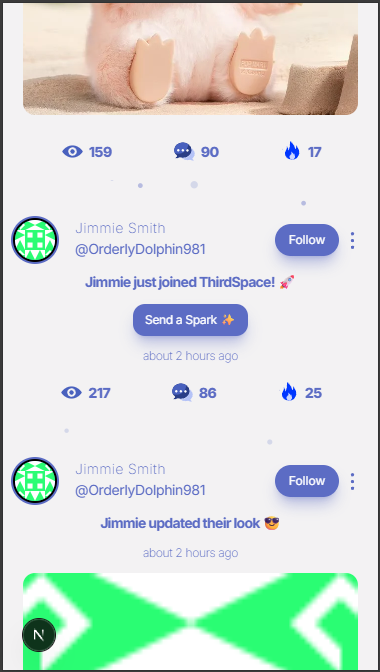 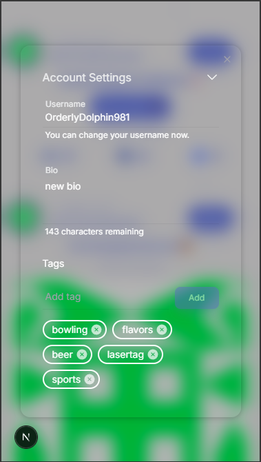 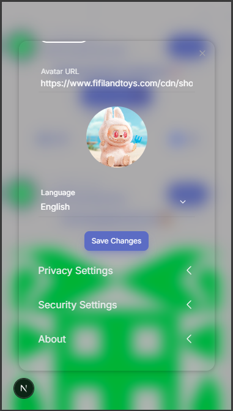 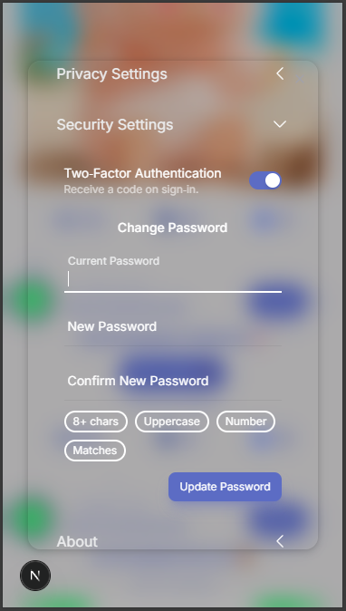 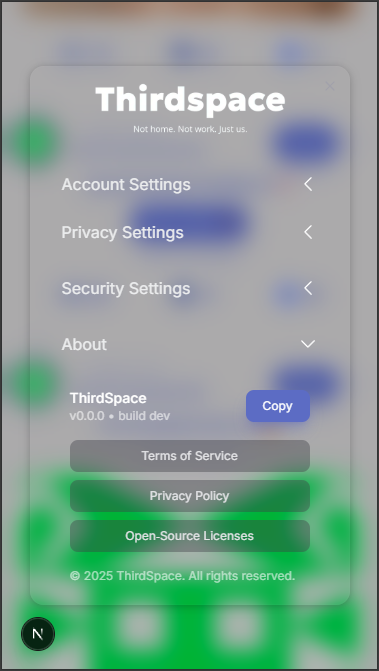 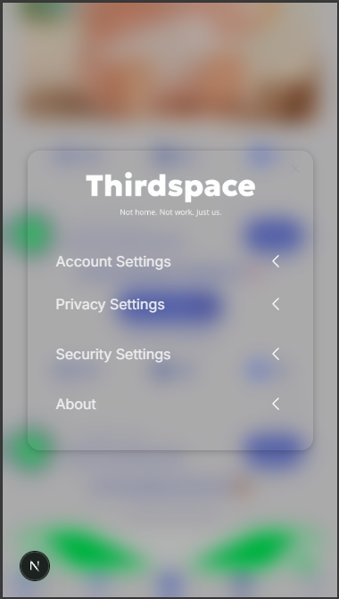 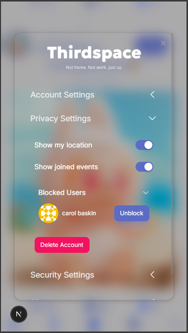 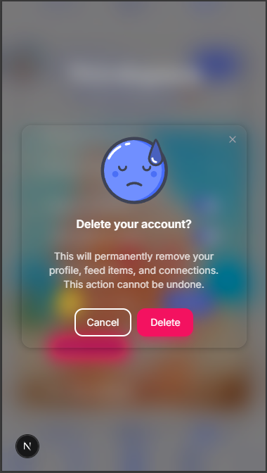

## 📬 Notifications

The app now includes a **notifications system** with global context and UI integration.

### Features

- **Global NotificationsContext**
  - Provides access to `notifications`, `notificationCount`, `accept`, `reject`, `clearAll`, and `refresh`.
  - Polls `/api/notifications` every 60s to keep data fresh.
- **Notifications Modal**
  - Displays all notifications with **filters** (read/unread/type) and **pagination**.
  - Uses **Lottie empty states** for a clean experience when no items are present.
  - Friend requests are displayed with an **accordion-style UI** (expand for Accept/Reject).
  - Bulk actions supported: **mark all read** and **clear all**.
- **Footer Badge**
  - Notification count badge connected to context.
  - Custom small badge styling for a compact display.

### Endpoints

- `GET /api/users/:id/get-notifications` – fetch notifications (with filters/pagination).
- `PATCH /api/users/:id/friend-request/accept` – accept a friend request.
- `PATCH /api/users/:id/friend-request/reject` – reject a friend request.
- `DELETE /api/users/:id/delete-notification` – remove a single notification.
- `DELETE /api/users/:id/read-notification/clear-all` – clear all notifications.

### Implementation Notes

- **Optimistic updates** are used for accept/reject actions (UI updates instantly, rolls back on failure).
- `id` field normalized from MongoDB `_id` for frontend consistency.
- Privacy/permissions are enforced in backend routes where relevant.

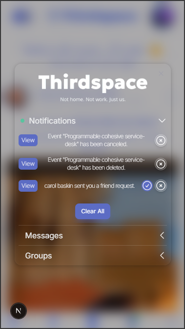 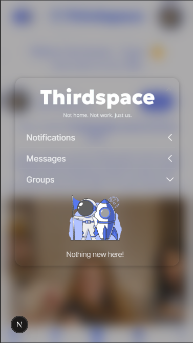 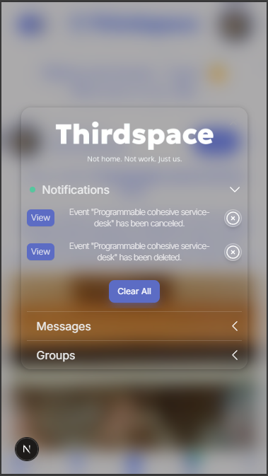 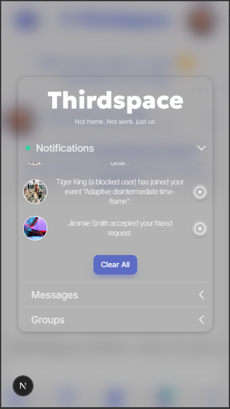 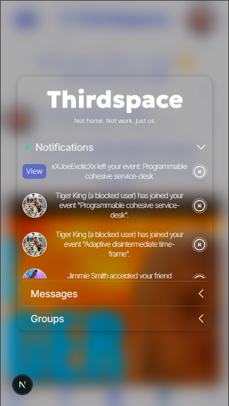 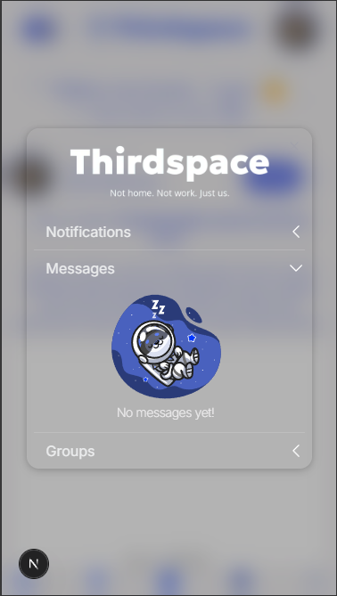 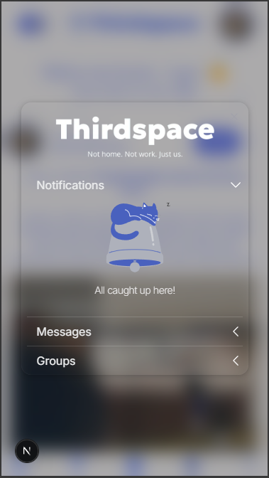
