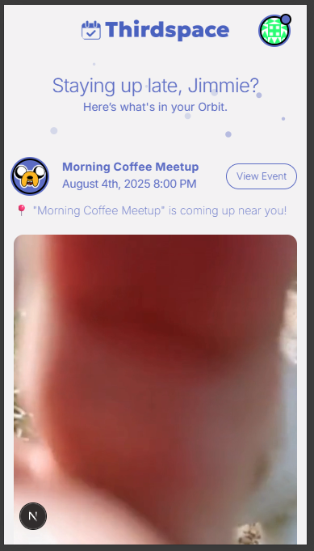
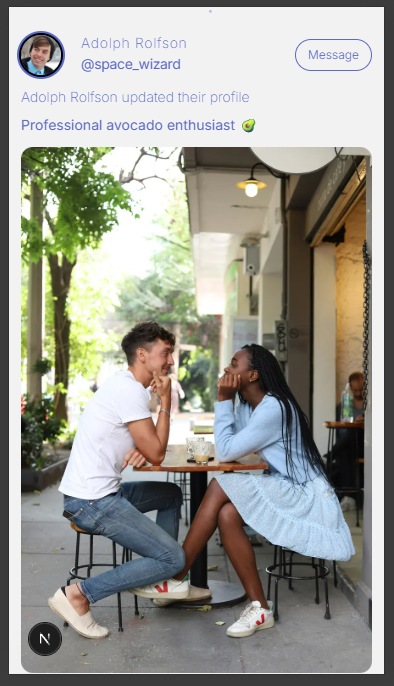
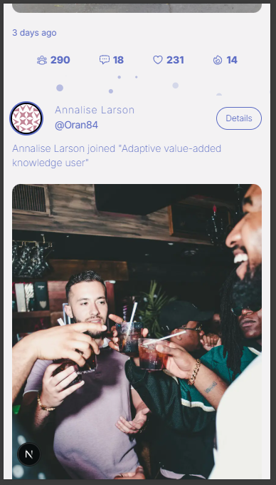
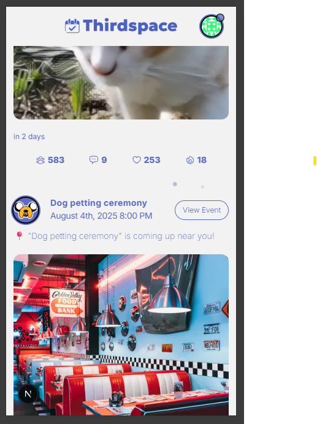
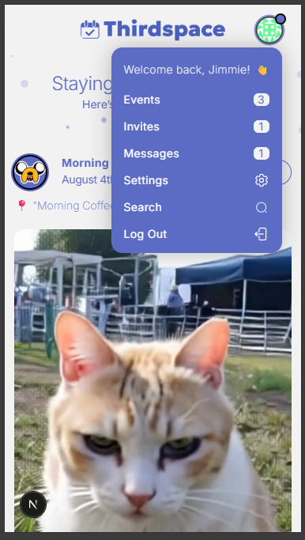

# Next.js & HeroUI Template

This is a template for creating applications using Next.js 14 (app directory) and HeroUI (v2).

[Try it on CodeSandbox](https://githubbox.com/heroui-inc/heroui/next-app-template)

## Technologies Used

- [Next.js 14](https://nextjs.org/docs/getting-started)
- [HeroUI v2](https://heroui.com/)
- [Tailwind CSS](https://tailwindcss.com/)
- [Tailwind Variants](https://tailwind-variants.org)
- [TypeScript](https://www.typescriptlang.org/)
- [Framer Motion](https://www.framer.com/motion/)
- [next-themes](https://github.com/pacocoursey/next-themes)

## How to Use

### Use the template with create-next-app

To create a new project based on this template using `create-next-app`, run the following command:

```bash
npx create-next-app -e https://github.com/heroui-inc/next-app-template
```

### Install dependencies

You can use one of them `npm`, `yarn`, `pnpm`, `bun`, Example using `npm`:

```bash
npm install
```

### Run the development server

```bash
npm run dev
```

### Setup pnpm (optional)

If you are using `pnpm`, you need to add the following code to your `.npmrc` file:

```bash
public-hoist-pattern[]=*@heroui/*
```

After modifying the `.npmrc` file, you need to run `pnpm install` again to ensure that the dependencies are installed correctly.

## License

Licensed under the [MIT license](https://github.com/heroui-inc/next-app-template/blob/main/LICENSE).

# ThirdSpace 🌐

**ThirdSpace** is a next-generation social planning app designed to help real people make real plans in real life — no pressure, no noise, just a space to be you.

---

## 🚀 Tech Stack

- **Framework**: [Next.js 15](https://nextjs.org/)
- **Frontend**: [React 18](https://reactjs.org/), [Tailwind CSS](https://tailwindcss.com/)
- **UI Components**: [HeroUI](https://heroui.dev/) + custom animations
- **Backend**: Node.js / Express-like API routes
- **Database**: MongoDB (via native driver)
- **Auth**: Custom + OAuth social logins (Google, GitHub, more coming soon)

---

## 🔧 Local Development Setup

1. **Clone the repo**

   ```bash
   git clone https://github.com/your-username/thirdspace.git
   cd thirdspace

   ```

2. **Create env.local**
   MONGO_URI=<your-mongo-connection-string>
   NEXT_PUBLIC_BASE_URL=http://localhost:3000

3. **Run the dev server**

npm run dev

**📁 Folder Structure (Highlights)**

├── app/
│ ├── login/ → Login UI
│ ├── register/ → Multi-step registration form
│ ├── providers/ → Custom Toast + Theme providers
├── components/
│ ├── register-forms/ → Step components (Name, Email, etc.)
│ ├── navigation/ → Floating buttons
│ ├── background-animations/
├── utils/
│ ├── frontend-backend-connection/
│ └── handleRegisterUser.ts
├── lib/
│ └── mongodb.ts → MongoDB client setup

## 🧪 Coming Soon

- 🎊 Post-registration "Thank You" page with confetti

- 📆 User event feed with smart planning suggestions

- 📲 Native mobile build (React Native or Expo)

- 🧙 AI social assistant ("What should we do this weekend?")

## 🧠 Philosophy

    ThirdSpace isn't just another event app. It's the antidote to flaky plans, endless group chats, and social burnout. Think: what Facebook events were supposed to be... but cooler.

# ThirdSpace Feed System - README

This document outlines the architecture, functionality, and development progress of the feed system for the ThirdSpace app, including visual references.

## Overview

The ThirdSpace feed displays dynamic social activity from a user's network, including:

- Friend connections (e.g., friend_accepted)

- Event RSVPs (e.g., joined_event)

- Profile updates

- Events coming up near the user

It supports pagination and is being extended to include infinite scroll capabilities.

## Backend API

### Endpoint

```
GET /api/users/:id/user-feed?page=1&limit=10
```

- Merges two sub-feeds:

  - `generateUserFeed(user, friends, events)`

  - `generateEventFeed(user, events)`

- Sorts results by timestamp

- Returns paginated feed with metadata

### Example Feed Item

```
{
  "id": "688ead8b28802692f9b3ceb9",
  "actor": {
    "eventId": "6886d6cda4b15a3b7a5095a4",
    "eventName": "Dog petting ceremony",
    "location": {
      "name": "Dog petting ceremony",
      "lat": 27.9,
      "lng": -82.8
    },
    "totalAttendance": 0,
    "startingDate": "2025-08-05T00:00:00.000Z"
  },
  "target": {
    "eventId": "6886d6cda4b15a3b7a5095a4",
    "title": "Dog petting ceremony"
  },
  "type": "event_coming_up",
  "timestamp": "2025-08-05T00:00:00.000Z"
}
```

## Frontend Structure

### Feed Context

Provides feed data to the page:

```
const FeedContext = createContext<FeedContextType | undefined>(undefined);
```

- `items[]`: Feed data

- `loading`: Status

- `refresh()`: Manual refetch

### Main Feed Page

- Auth-protected via `useSession`

- Renders `GreetingHeader` and a list of `FeedItemCard`s

### FeedItemCard

- Handles all rendering logic based on feed `type`

- Dynamic layout depending on type: event, profile update, etc.

### FeedCardFooter

- Renders action/footer content depending on `type`

- Conditional block for `event_coming_up` uses `formatDistanceToNow()` for time

- Includes button linking to event detail page

## Screenshots

### Visual representation of the working feed system:



### Profile Update Card



### Joined Event Card



### Event Reminder with Time Header



### User Dropdown Menu


