# Next.js & HeroUI Template

This is a template for creating applications using Next.js 14 (app directory) and HeroUI (v2).

[Try it on CodeSandbox](https://githubbox.com/heroui-inc/heroui/next-app-template)

## Technologies Used

- [Next.js 14](https://nextjs.org/docs/getting-started)
- [HeroUI v2](https://heroui.com/)
- [Tailwind CSS](https://tailwindcss.com/)
- [Tailwind Variants](https://tailwind-variants.org)
- [TypeScript](https://www.typescriptlang.org/)
- [Framer Motion](https://www.framer.com/motion/)
- [next-themes](https://github.com/pacocoursey/next-themes)

## How to Use

### Use the template with create-next-app

To create a new project based on this template using `create-next-app`, run the following command:

```bash
npx create-next-app -e https://github.com/heroui-inc/next-app-template
```

### Install dependencies

You can use one of them `npm`, `yarn`, `pnpm`, `bun`, Example using `npm`:

```bash
npm install
```

### Run the development server

```bash
npm run dev
```

### Setup pnpm (optional)

If you are using `pnpm`, you need to add the following code to your `.npmrc` file:

```bash
public-hoist-pattern[]=*@heroui/*
```

After modifying the `.npmrc` file, you need to run `pnpm install` again to ensure that the dependencies are installed correctly.

## License

Licensed under the [MIT license](https://github.com/heroui-inc/next-app-template/blob/main/LICENSE).

# ThirdSpace 🌐

**ThirdSpace** is a next-generation social planning app designed to help real people make real plans in real life — no pressure, no noise, just a space to be you.

---

# VIDEO DEMOS:

[Google Drive](https://drive.google.com/drive/folders/1PXuyRo8X-e0AiXwJJtfpQM2DY0uiE85U?usp=sharing)

## 🚀 Tech Stack

- **Framework**: [Next.js 15](https://nextjs.org/)
- **Frontend**: [React 18](https://reactjs.org/), [Tailwind CSS](https://tailwindcss.com/)
- **UI Components**: [HeroUI](https://heroui.dev/) + custom animations
- **Backend**: Node.js / Express-like API routes
- **Database**: MongoDB (via native driver)
- **Auth**: Custom + OAuth social logins (Google, GitHub, more coming soon)

---

## 🔧 Local Development Setup

1. **Clone the repo**

   ```bash
   git clone https://github.com/your-username/thirdspace.git
   cd thirdspace

   ```

2. **Create env.local**
   MONGO_URI=<your-mongo-connection-string>
   NEXT_PUBLIC_BASE_URL=http://localhost:3000

3. **Run the dev server**

npm run dev

**📁 Folder Structure (Highlights)**

├── app/
│ ├── login/ → Login UI
│ ├── register/ → Multi-step registration form
│ ├── providers/ → Custom Toast + Theme providers
├── components/
│ ├── register-forms/ → Step components (Name, Email, etc.)
│ ├── navigation/ → Floating buttons
│ ├── background-animations/
├── utils/
│ ├── frontend-backend-connection/
│ └── handleRegisterUser.ts
├── lib/
│ └── mongodb.ts → MongoDB client setup

## 🧪 Coming Soon

- 🎊 Post-registration "Thank You" page with confetti

- 📆 User event feed with smart planning suggestions

- 📲 Native mobile build (React Native or Expo)

- 🧙 AI social assistant ("What should we do this weekend?")

## 🧠 Philosophy

    ThirdSpace isn't just another event app. It's the antidote to flaky plans, endless group chats, and social burnout. Think: what Facebook events were supposed to be... but cooler.

# ThirdSpace Feed System - README

This document outlines the architecture, functionality, and development progress of the feed system for the ThirdSpace app, including visual references.

## Overview

The ThirdSpace feed displays dynamic social activity from a user's network, including:

- Friend connections (e.g., friend_accepted)

- Event RSVPs (e.g., joined_event)

- Profile updates

- Events coming up near the user

It supports pagination and is being extended to include infinite scroll capabilities.

## Backend API

### Endpoint

```
GET /api/users/:id/user-feed?page=1&limit=10
```

- Merges two sub-feeds:

  - `generateUserFeed(user, friends, events)`

  - `generateEventFeed(user, events)`

- Sorts results by timestamp

- Returns paginated feed with metadata

### Example Feed Item

```
{
  "id": "688ead8b28802692f9b3ceb9",
  "actor": {
    "eventId": "6886d6cda4b15a3b7a5095a4",
    "eventName": "Dog petting ceremony",
    "location": {
      "name": "Dog petting ceremony",
      "lat": 27.9,
      "lng": -82.8
    },
    "totalAttendance": 0,
    "startingDate": "2025-08-05T00:00:00.000Z"
  },
  "target": {
    "eventId": "6886d6cda4b15a3b7a5095a4",
    "title": "Dog petting ceremony"
  },
  "type": "event_coming_up",
  "timestamp": "2025-08-05T00:00:00.000Z"
}
```

## Frontend Structure

### Feed Context

Provides feed data to the page:

```
const FeedContext = createContext<FeedContextType | undefined>(undefined);
```

- `items[]`: Feed data

- `loading`: Status

- `refresh()`: Manual refetch

### Main Feed Page

- Auth-protected via `useSession`

- Renders `GreetingHeader` and a list of `FeedItemCard`s

### FeedItemCard

- Handles all rendering logic based on feed `type`

- Dynamic layout depending on type: event, profile update, etc.

### FeedCardFooter

- Renders action/footer content depending on `type`

- Conditional block for `event_coming_up` uses `formatDistanceToNow()` for time

- Includes button linking to event detail page

## Screenshots

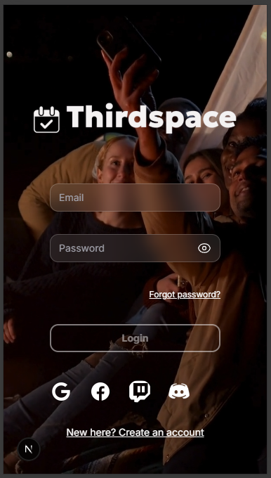

### Visual representation of the working feed system:

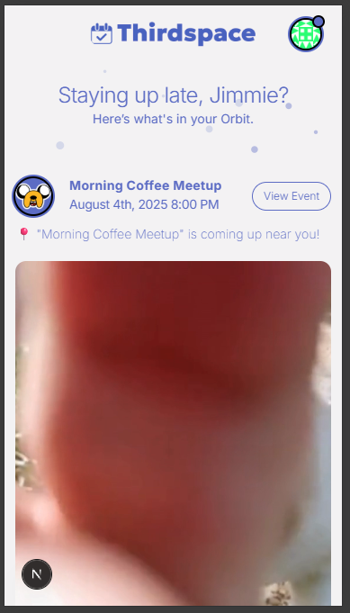

### Profile Update Card

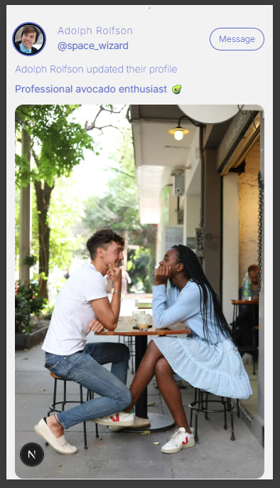

### Joined Event Card

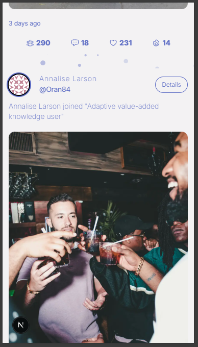

### Event Reminder with Time Header

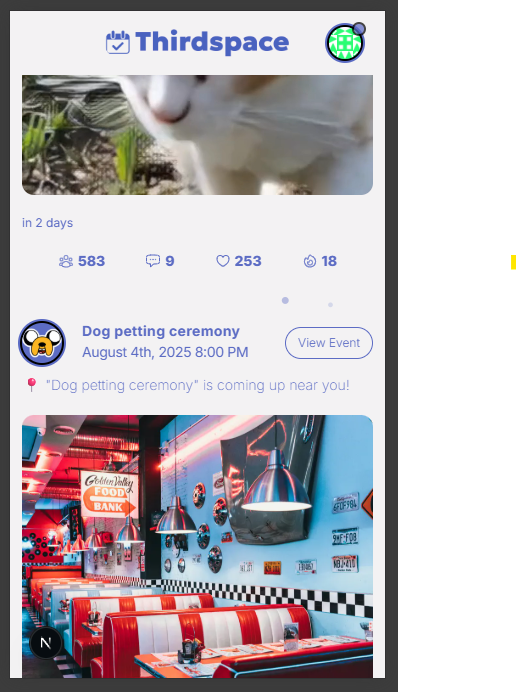

### User Dropdown Menu

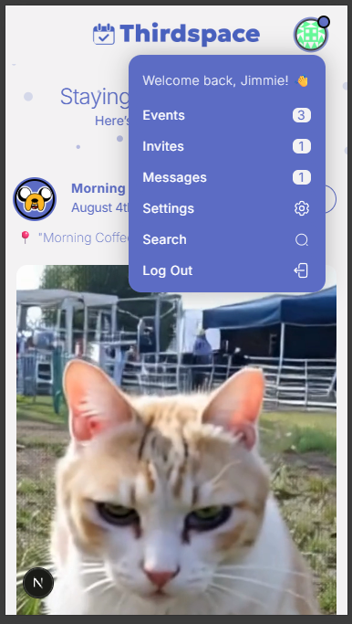

### Social‑Style Activity Feed (`SCRUM-44`)

- **Vertical Scroll Feed** --- Displays recent activities from a user's friends in a Twitter/Instagram‑style vertical scroll.

- **Supported Activity Types**:

  - Hosted events

  - Event RSVPs / attendance

  - Friend requests accepted

  - Profile updates (bio, avatar, location, username, tags, status)

  - Status posts with optional image attachments

- **Real‑Time Updates**:

  - `useSmartFeedRefresh` hook for periodic refresh

  - Displays a **"New Updates"** banner when fresh items are available

  - Merges new and existing items with `mergeFeedItems` to prevent duplicates

- **Responsive Card Design**:

  - `FeedItemCard` component with contextual actions per feed type

  - Type guards (`isEvent`) ensure correct rendering for event vs user activities

  - Mobile‑first, adaptive layout

- **Backend Support**:

  - `/user-feed` endpoint fetches persisted feed data from MongoDB

  - Feed generation functions (`generateUserFeed` / `generateEventFeed`)

  - Deduplication logic on insert to prevent redundant entries

  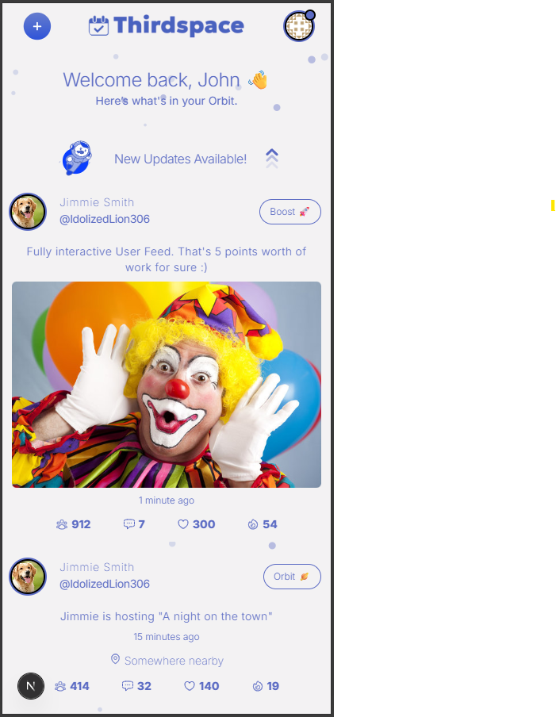
  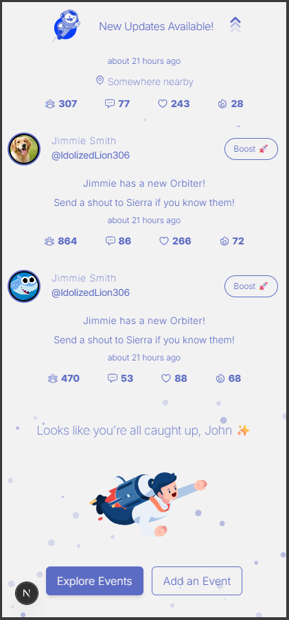

## 🚀 Current Status

- ✅ MVP in active development (August 2025)
- ✅ Backend architecture live with MongoDB, Express, and Next.js
- ✅ Frontend rewritten with TailwindCSS + HeroUI
- ✅ Auth + Smart Session Handling via NextAuth
- ✅ Feed system launched with deep real-time functionality

---

## 🔄 Recent Worklog (July–August 2025)

### 🎯 Status Feed Overhaul (`/feed`)

- ✅ Implemented `status_posted` and `profile_status_updated` feed item types
- ✅ Added logic for self-status visibility (users now see their own posts)
- ✅ Normalized `actor` and `target` structure across feed generators
- ✅ Added timestamp control for smart refreshes and delta-based updates

### 🪓 Data Debugging & Cleanup

- ✅ Discovered malformed feed targets (`ttile` typo, etc.)
- ✅ Wrote a nuke route (`DELETE /api/dev/wipe`) for quick dev resets
- ✅ Refactored `generateUserFeed()` to pull from MongoDB and reduce duplication

### 🐞 Bug Fixes (Big ones)

- 🧠 Fixed JSX bug where attachments were hidden inside a function block
- 🕳️ Tracked down silent fails in `status_posted` feed items due to shape mismatches
- ⚠️ Swiper CSS bugs (extra bottom bar, overflow) patched with deep Tailwind overrides
- ⏱️ Fixed Smart Refresh logic to actually respect timestamp deltas (60s)

### 🎨 Frontend UX

- ✅ SwiperJS integration for photo attachments (status + events)
- ✅ Responsive grid layout for multi-attachment feed cards
- ✅ Fallback for gravatar and username display
- ✅ Tooltips + accessibility cleanups

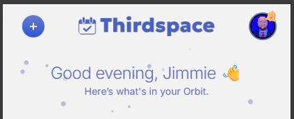
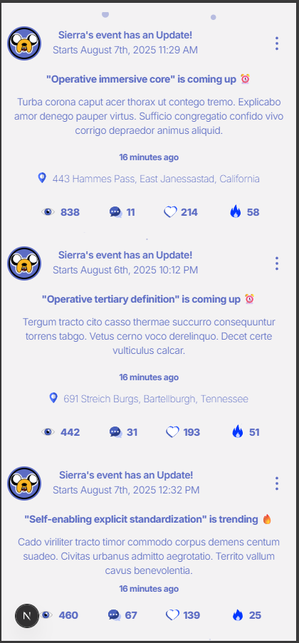
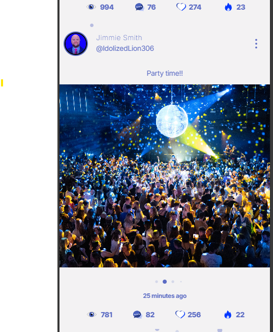
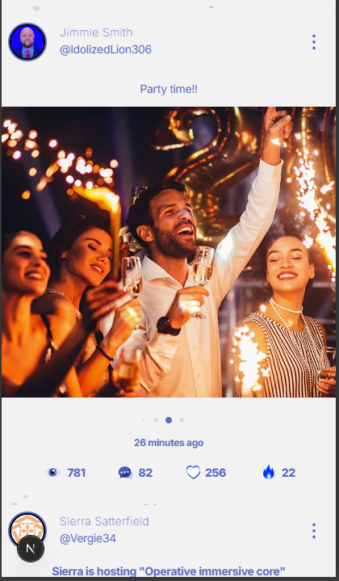
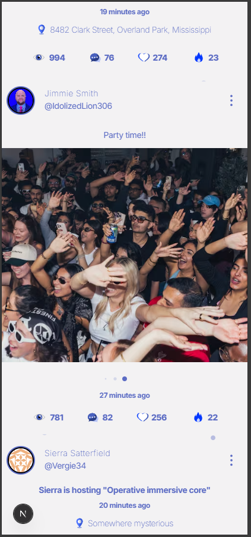

## 🆕 Recent Update — Location Attachments in Feed

We’ve added support for **location-based profile updates** with image attachments pulled from the **Unsplash API**.

### How it works

- When a user updates their **location** in their profile, the backend now queries Unsplash for a relevant photo based on the city/state string.
- The first result (if available) is attached to the **`profile_location_updated`** feed item.
- Photo credit metadata is stored alongside the attachment for attribution.
- If Unsplash is down or rate-limited, the feed item still posts without an attachment.

### Visibility rules

- Currently, all location updates appear in friends’ feeds.
- Future updates will incorporate **follower-based visibility** for public/private events and profile changes.

### Developer Notes

- **Frontend** displays these attachments inside the `AttachmentSwiper` component for a smooth swipe-through UI.
- **Backend** enforces type consistency:
  - Dates stored as `Date` objects server-side.
  - Strings for timestamps in API responses.
  - ObjectIds stored for relationships, cast to strings in responses.
- Code changes located in:
  - `PATCH /users/:id` (profile update logic)
  - `UserFeedDoc` model (`target.attachments` & `target.photoCredit`)
  - `AttachmentSwiper` component

## Recent Updates

### 🆕 Features

- **Sticky Mobile Footer Navigation**  
  Added a fixed footer nav bar for mobile view with quick access to:

  - Search
  - My Events
  - Settings
  - Back to Top
  - Direct Messages (DM)

- **Back to Top Floating Button**  
  Added a floating Back to Top button (Lottie animation) positioned bottom-right on main feed for quick scrolling. Tooltip on hover for clarity.

- **Primary-Color Switch Styling**  
  Updated theme toggle switch to retain primary brand background color in both on/off states, ensuring visual consistency.

### 🐛 Bug Fixes

- **Duplicate Feed Item Fix**  
  Fixed a race condition that caused duplicate `profile_location_updated` feed entries (one with Unsplash image, one without). Updates now guard against simultaneous PATCH requests and only insert feed items when a real change occurs.

- **Theme Reset to Light Mode**  
  Cleared persisted dark mode settings and enforced light theme as default to prevent unwanted style overrides on inputs/buttons.

  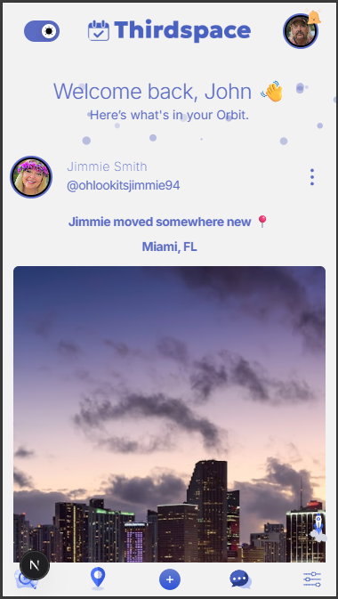
  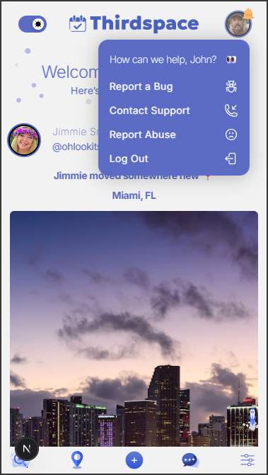
  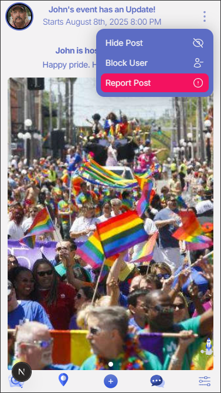
  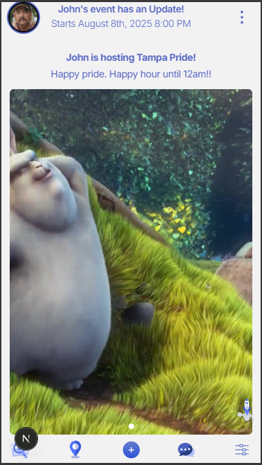

  # ThirdSpace

ThirdSpace is a low-pressure social coordination platform that helps friends, communities, and new connections find each other, meet up, and share events — all in real time.

---

## 🚀 Recent Updates (Aug 2025)

### Geospatial Features

- **Interactive Event Maps** — All events now display an embedded, zoomable map powered by MapLibre.
- **Nearby Events API** (`/api/users/:id/get-nearby-events`)
  - Finds events within a given radius of the user.
  - Uses MongoDB `$nearSphere` queries on a `2dsphere` index.
  - Stores coordinates as **GeoJSON Point** `[lng, lat]`.
- **Nearby Users API** (`/api/users/:id/get-nearby-users`)
  - Finds users within a radius that share overlapping tags.
  - Uses `$geoNear` for distance sorting and `$setIntersection` for tag matching.
  - Scores results by tag overlap (weighted) and proximity.
- **Indexes**:
  - `location.geo` (2dsphere) for both events and users.
  - `tags` for faster shared-interest matching.

### Data Improvements

- **Default Location Fallback** — If no coordinates are provided, system uses geocoding or a safe default.
- **AI Keyword Extraction** — Auto-generates tags from bios/interests for better nearby user matching.
- **Type Safety Fixes** — Resolved `number | undefined` issues for lat/lng props.

### UI Fixes

- **Footer Scroll Bug** — Footer hides when scrolling down. visible when when scrolling up (sticky + z-index fix).
- **Smart Refresh Click Target** — “New update available” banner now makes the entire banner clickable, not just the arrow.

---

## 📦 API Endpoints

### **Nearby Events**

Returns users within the radius that share at least `minShared` tags.

---

## ⚙️ Setup Notes

- Ensure MongoDB collections for `users` and `events` have `2dsphere` indexes on `location.geo`.
- Geocoding utilities require environment variable `BASE_URL` for reverse geocoding calls.

---

## 📅 Next Steps

- Add client-side UI for nearby user discovery.
- Improve AI tag extraction fallback and caching.
- Filter nearby events by user interests.

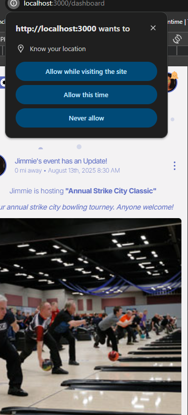
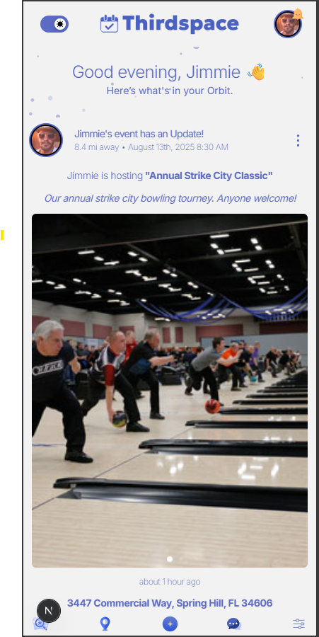
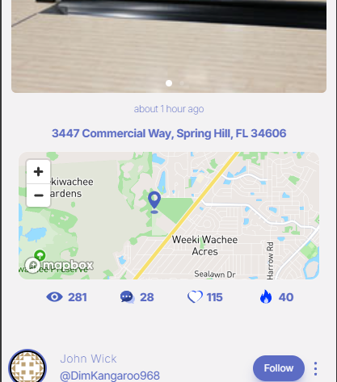

# 🕐 Sprint Worklog (52h) - End of sprint 1 - SCRUM 35

## Feed System Enhancements – 21h

- Implemented `generateUserFeed` with friend + self actor support (6h)
- Added distance calculations and geocoding fallback for events (3h)
- Normalized event attachments, snippets, and locations (2h)
- Added profile update feed types (`avatar`, `location`, `status`) (4h)
- Debugged unexpected logging of `username`, `bio`, `tags` updates and filtered them out via `PUBLIC_FEED_TYPES` allowlist (4h)
- Verified deduplication logic and confirmed persistence for admin/audit cases (2h)

## Frontend Feed UI – 10h

- Built out `FeedItemCard` display logic with actor/event type checks (3h)
- Fixed avatar fallback to Gravatar and ensured event vs user actors display correctly (2h)
- Implemented empty state handling and debug scaffolding (1h)
- Added quirky “Say Hi” button in place of snippet for new joins (2h)
- Brainstormed and designed “Spark” feature for karma/upvotes (2h)

## Profile & Settings – 8h

- Extended `ProfileSettingsModal` with bio, tags, and language updates (3h)
- Added character limit enforcement and live counter for bio (2h)
- Fixed text color / theming issues in `Textarea` (1h)
- Verified profile updates only log intended feed items (2h)

## Backend / API – 7h

- Implemented `GET /api/feed/:id` endpoint with pagination, since filter, and friends/events lookup (4h)
- Combined generated + DB feed items with proper sorting (2h)
- Added filters to hide non-public updates in API response (1h)

## Infra / Dev Workflow – 6h

- Debugged smart refresh logic and deduplication on user feed (2h)
- Setup fire Lottie animation + placeholder for spark/karma counter (1h)
- Scoped upcoming admin/audit requirements (tags, bio, username updates to remain stored) (1h)
- Added commit message + documentation polish (2h)

## Design & Planning – 5h

- Discussed naming options for quirky actions (“Zap” → “Spark”) (1h)
- Scoped feed growth/anti-bloat strategy (1h)
- Planned Sprint 3 backlog items (admin console, karma system, audit feed visibility) (1h)
- Brainstormed views + comments integration into feed (2h)

---

✅ **Total: 52 hours**

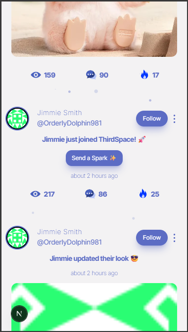 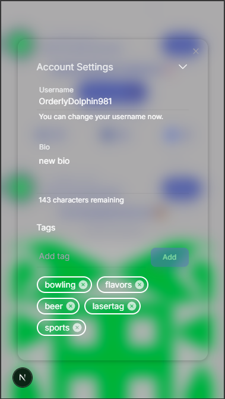 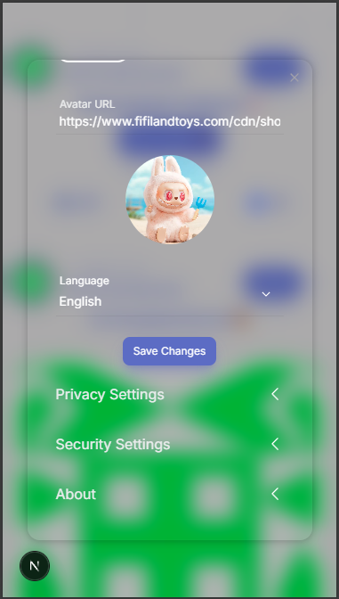 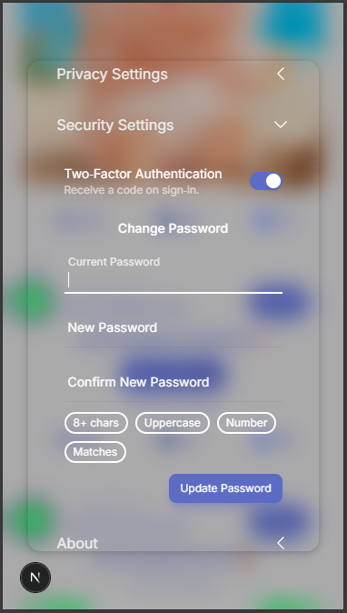 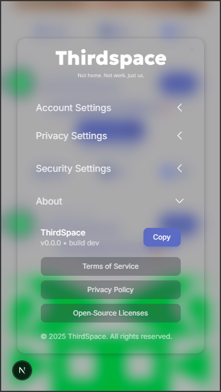 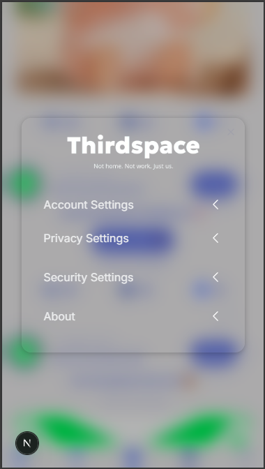 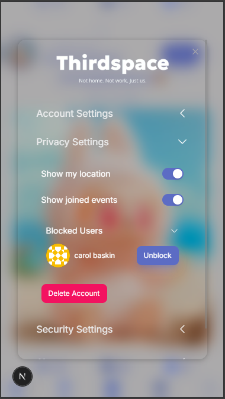 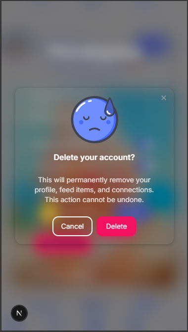

## 📬 Notifications

The app now includes a **notifications system** with global context and UI integration.

### Features

- **Global NotificationsContext**
  - Provides access to `notifications`, `notificationCount`, `accept`, `reject`, `clearAll`, and `refresh`.
  - Polls `/api/notifications` every 60s to keep data fresh.
- **Notifications Modal**
  - Displays all notifications with **filters** (read/unread/type) and **pagination**.
  - Uses **Lottie empty states** for a clean experience when no items are present.
  - Friend requests are displayed with an **accordion-style UI** (expand for Accept/Reject).
  - Bulk actions supported: **mark all read** and **clear all**.
- **Footer Badge**
  - Notification count badge connected to context.
  - Custom small badge styling for a compact display.

### Endpoints

- `GET /api/users/:id/get-notifications` – fetch notifications (with filters/pagination).
- `PATCH /api/users/:id/friend-request/accept` – accept a friend request.
- `PATCH /api/users/:id/friend-request/reject` – reject a friend request.
- `DELETE /api/users/:id/delete-notification` – remove a single notification.
- `DELETE /api/users/:id/read-notification/clear-all` – clear all notifications.

### Implementation Notes

- **Optimistic updates** are used for accept/reject actions (UI updates instantly, rolls back on failure).
- `id` field normalized from MongoDB `_id` for frontend consistency.
- Privacy/permissions are enforced in backend routes where relevant.

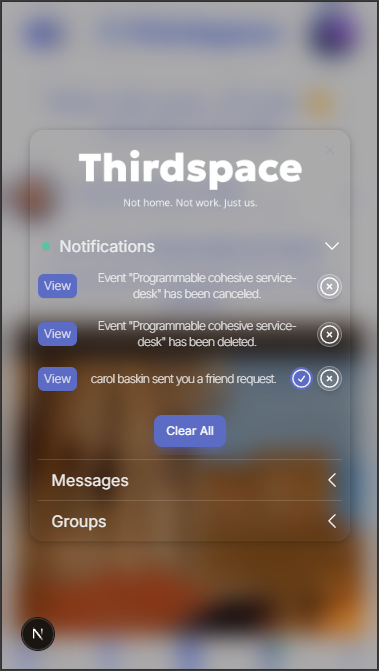 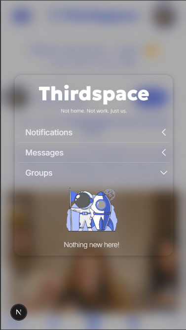 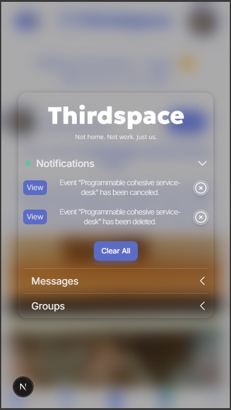 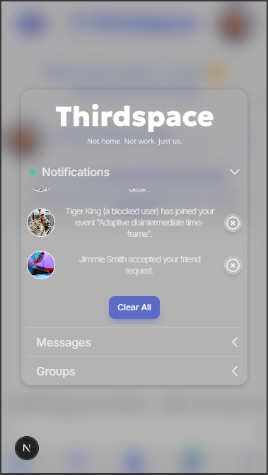 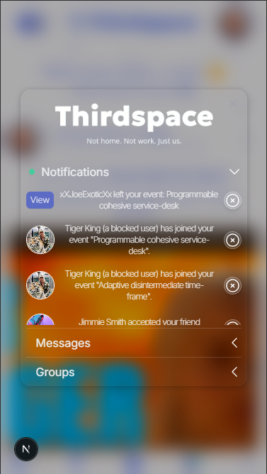 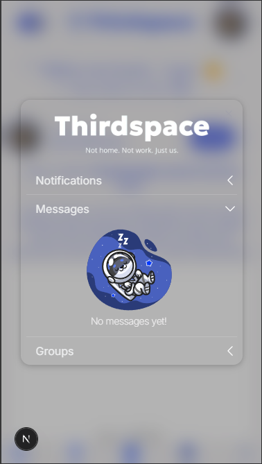 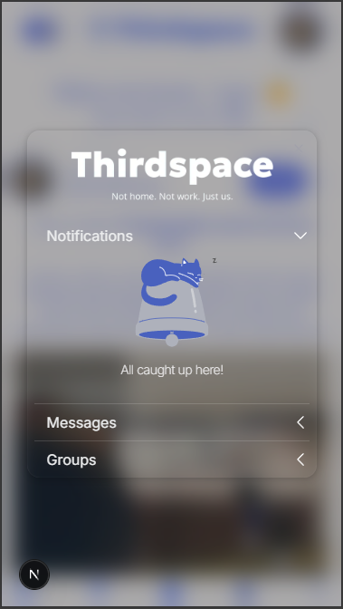

## SCRUM-86 - ## Privacy & Visibility (New)

- Added `visibility` field + granular privacy config (`location`, `hostedEvents`, `joinedEvents`, `statusUpdate`).
- Implemented **Profile Settings Modal** with a `VisibilitySettings` select component (glass-style UI).
- Integrated visibility rules into:
  - **Profile API** — block/allow profile fetch based on privacy.
  - **Status API** — status updates only pushed to feeds if allowed by privacy.
  - **Event API** — hosted events pushed to friends/followers feeds only if user’s visibility allows.
  - **Feed Generators** — guards prepared using `canViewerSee(user, viewer, field)` for consistent enforcement.
- Users can now:
  - Set profile visibility to: `Public`, `Followers`, `Friends`, or `Off`.
  - Control whether their **location, hosted events, joined events, and status updates** appear in others’ feeds.

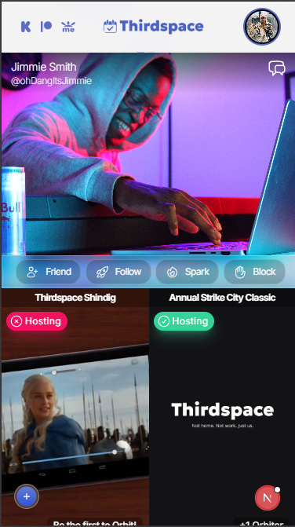 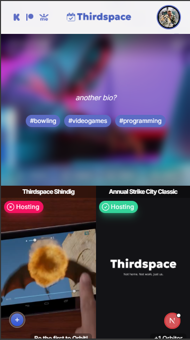 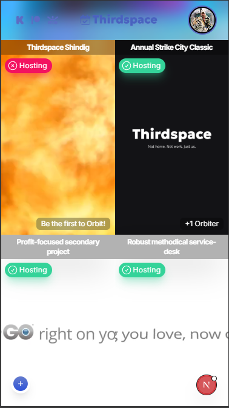 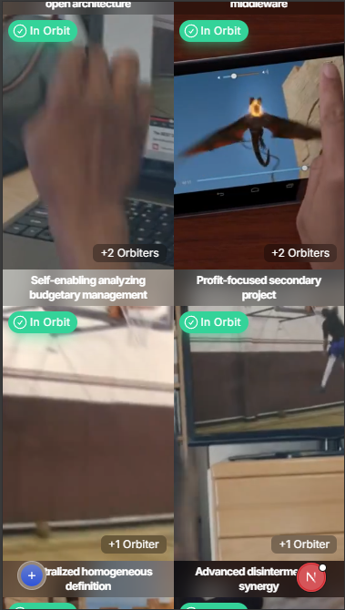 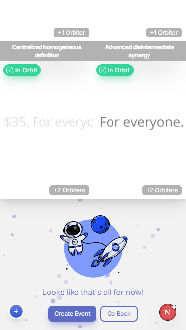 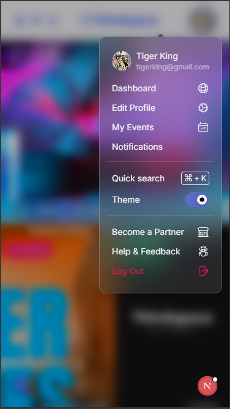 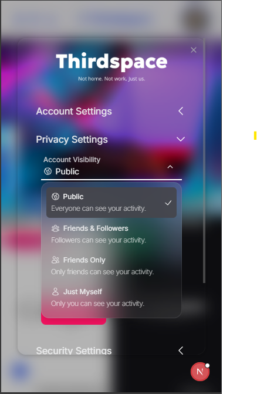 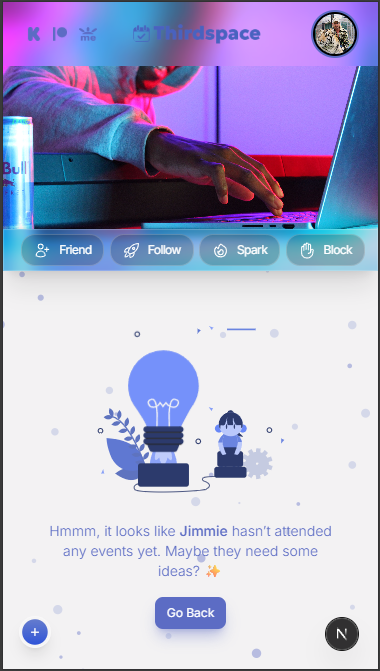 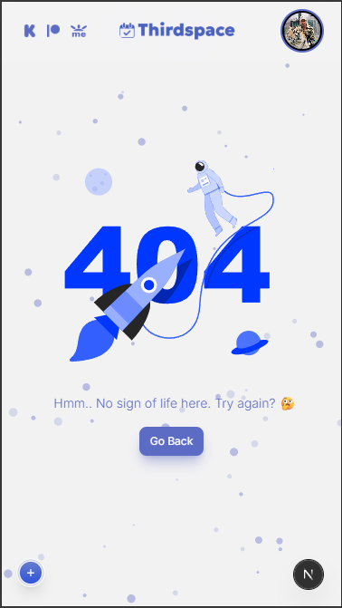 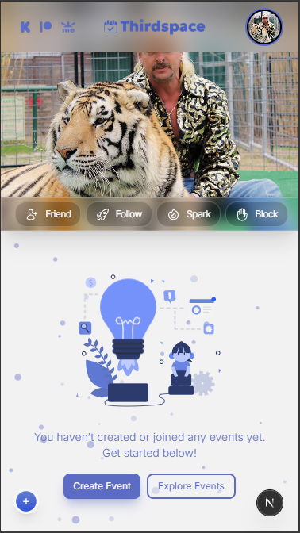

### 🚀 Sprint #1 Deliverables – Event Management & View

**Event View Page (`/event/[id]`)**

- New route for displaying full event details (title, description, date/time, location, tags, host, attendees).
- Users can **join/leave** events with real-time feedback and confetti 🎉.
- Hosts see **extra actions**:
  - ✏️ Edit event (opens modal pre-filled with current data)
  - ❌ Cancel event (updates status + notifies attendees)
- Integrated **comment system**: hosts and participants can add comments; shown in chronological order.
- Placeholder for **Orbit button** included (future feature).
- Responsive layout, mobile-first design.

**Edit Event Modal**

- Hosts can update:
  - Title, Description, Date/Start Time
  - Location (Mapbox autocomplete)
  - Tags (comma-separated input w/ chips)
  - Attachments (upload/remove)
  - Budget estimate (slider + currency display)
- Changes persist via `PATCH /api/events/:id/update-event`.
- Save shows loading state + toasts, closes modal on success.
- Cancel event via `PATCH /api/events/:id/cancel-event`.

**Budget & Donation Enhancements**

- Hosts can set an **estimated cost** for events.
- Event page shows “Orbit Goal” with amount and currency.
- Donation goal UI scaffolded:
  - Displays total raised vs. estimated cost.
  - Progress bar visualization for contributions.

**Backend Integrations**

- Event edit and cancel routes implemented.
- Updates propagate to feeds + attendee notifications.
- Date handling normalized to **ISO strings**.
- Location stored as `{ name, lat, lng, geo }` for clean geocoding and mapping.

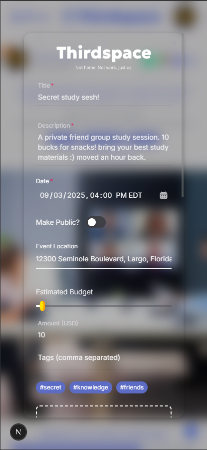 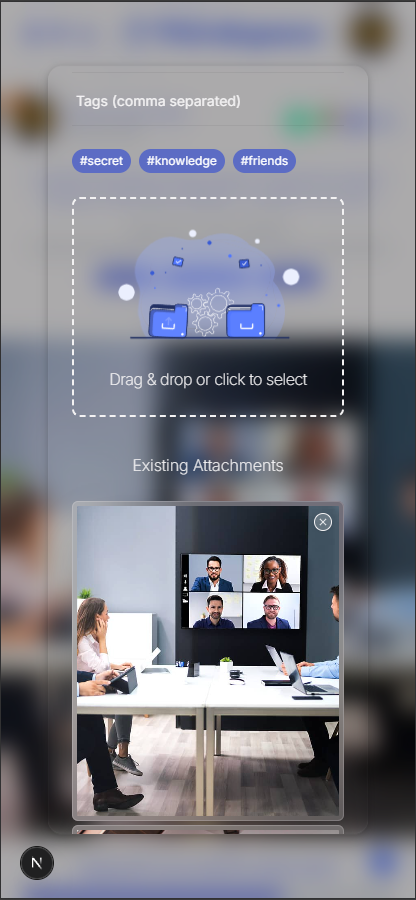 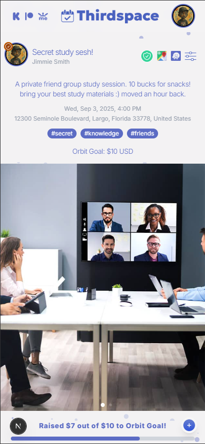 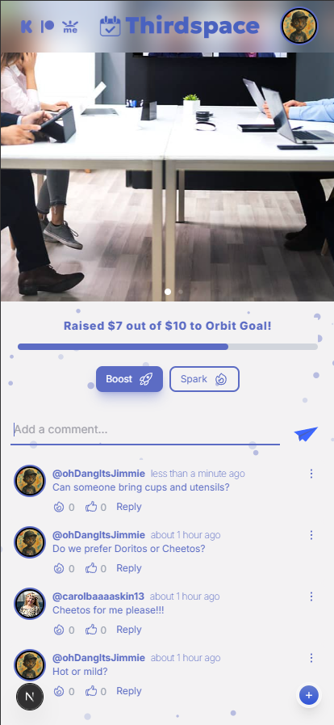 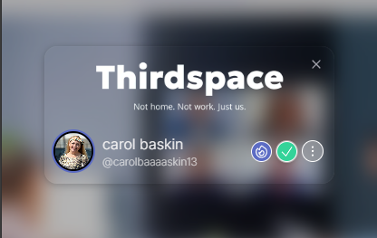 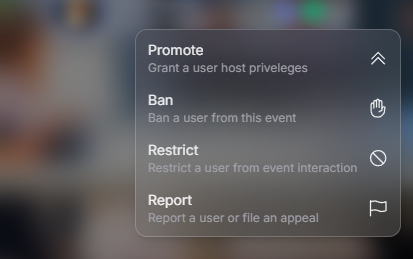 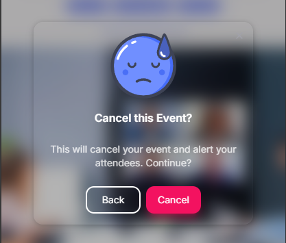 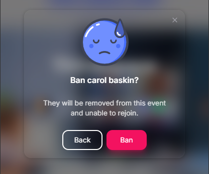  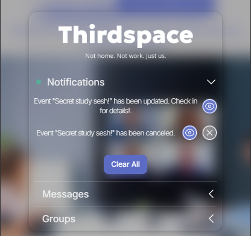 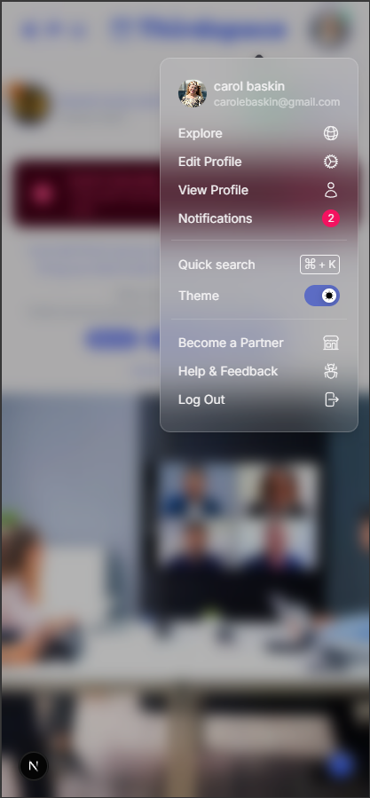

## ✅ Recent Feature Updates

### Status Creation (Complete)

- Added a **Create Status** modal for posting updates to the user feed.
- Supports **text content + optional attachments**.
- Uses a reusable **presigned S3 upload flow** (request presigned URLs → upload → store public URLs).
- Includes client-side validation + toast feedback for success/failure.

### Event Creation (Complete)

- Added a **Create Event** modal for publishing events.
- Captures core fields:
  - title, description, tags
  - date + start time (timezone-safe handling)
  - location (autocomplete)
  - budget estimate
  - public/private visibility
  - optional attachments
- Uses the same reusable **presigned upload helper** for event attachments.
- Includes client-side validation + toast feedback for success/failure.

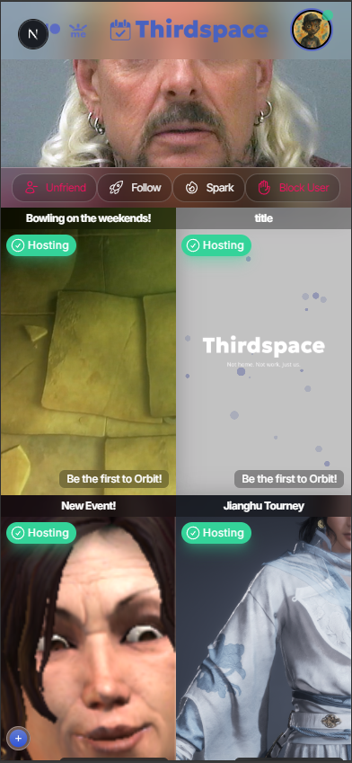 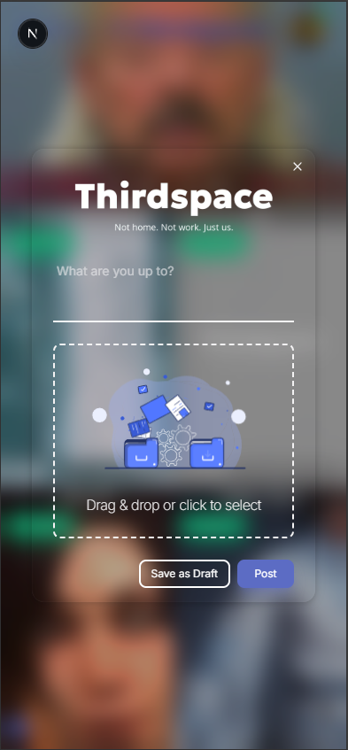 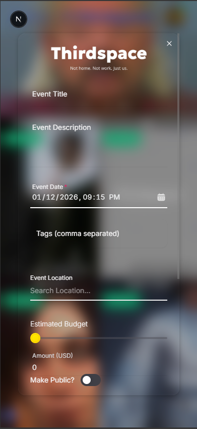 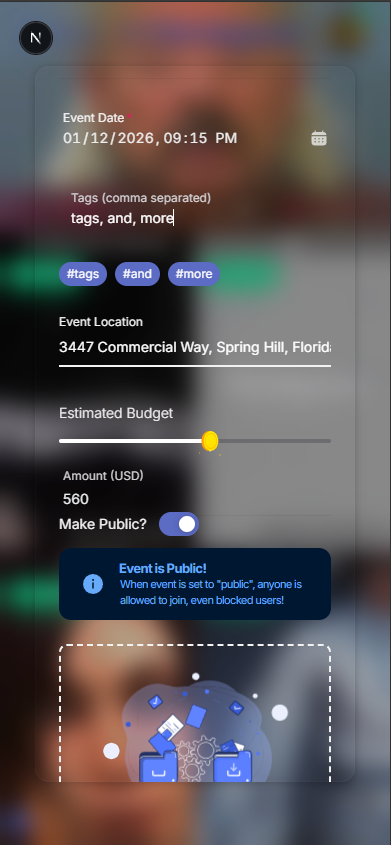

## ✨ Spark Interaction (Double-Tap Support)

Users can double-tap event media to send a **Spark** — a lightweight expression of support.

Sparks:

- Are tied to the canonical event (not feed items)
- Are deduplicated via indexed reactions (1 spark per user per event)
- Trigger a centered pulse animation for immediate feedback
- Do not introduce public popularity metrics

Designed to encourage positive engagement without creating comparison pressure.
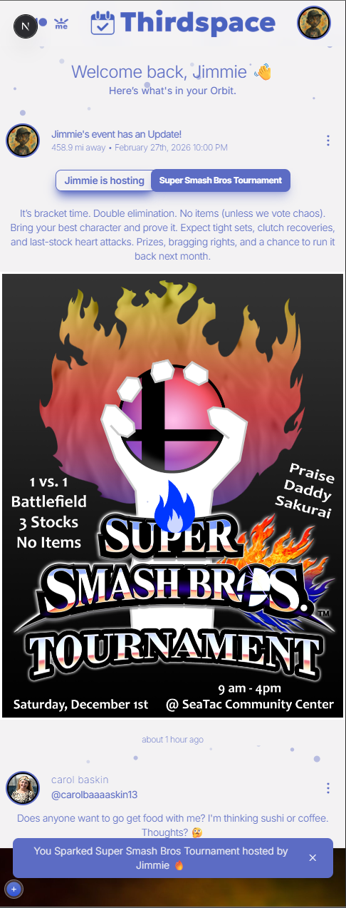

## Development Summary – 3/3/26

Today focused on engagement parity, UX refinement, and comment system stability.

### 🔥 Spark System Parity

- Completed spark / unspark functionality for both statuses and events
- Implemented optimistic UI updates with rollback handling
- Added spark pulse overlay animation in status modal
- Ensured event page spark state initializes correctly from backend

### 👥 Friend Spark Previews

- Built backend batching endpoint for friend spark metadata
- Hydrated feed items with friend preview users
- Integrated preview avatars into feed cards
- Verified correct rendering across accounts

### 📰 Feed Hydration Improvements

- Refined spark metadata injection during feed load
- Prevented duplicate hydration loops
- Cleaned async hook logic and dependency issues

### 💬 Comment System Refactor

- Refactored comments for reusability
- Separated status and event styling layers
- Fixed modal scroll and overflow conflicts
- Implemented Instagram-style split layout (media shrinks, comments scroll)
- Fixed HeroUI input placeholder styling behavior

### 📸 Media / Swiper Fixes

- Updated AttachmentSwiper to respect parent container height
- Resolved layout conflicts when modal resizes
- Fixed router usage (`next/navigation` instead of `next/router`)
- Increased attachment upload size limit from 10MB to 50MB

### 🧼 Cleanup & Stability

- Removed conflicting overlay behavior for videos
- Fixed hook misuse and conditional render issues
- Closed remaining tickets tied to spark + comment systems

### Double-tap functionality moved to status detail view

- Dedicated status detail view now holds spark functionality
- base icon still shows on spark
  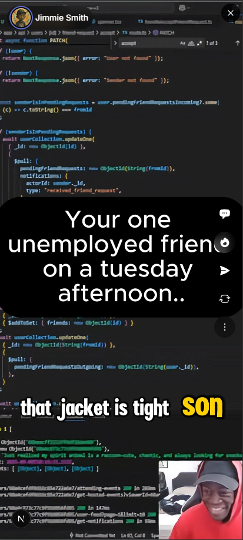 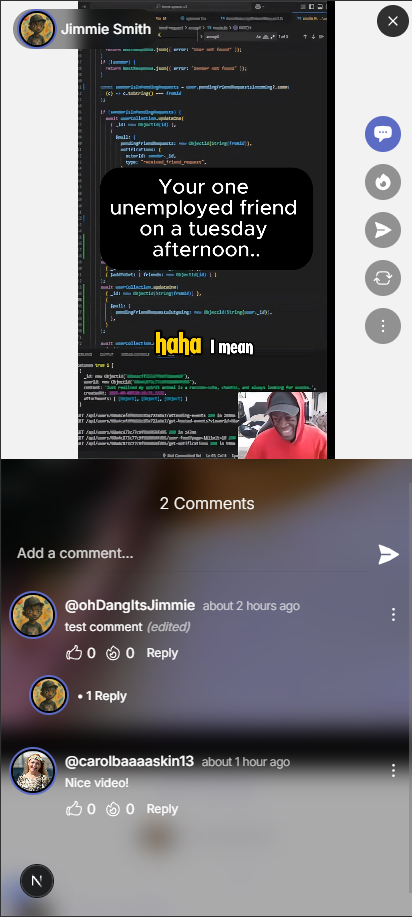 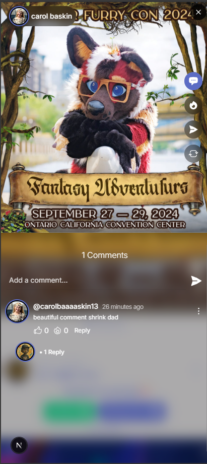

  # Daily Update – ThirdSpace App (3/4/2026)

## Overview

Today's focus was on improving discoverability and polish for the feed, as well as refactoring key pages for smoother UX. Progress was made on the "Solar System" and "Space Station" modules, along with privacy and registration improvements.

## Key Updates

### Feed Enhancements

- **Solar System (Discover Events)**
  - Added top-of-feed placement logic for nearby events.
  - Ensured new events appear prominently for users.
- **Space Station (Discover Users)**
  - Filtered out friends and self to show only new potential connections.
  - Integrated top-of-feed placement for better visibility.

### UI / UX Tweaks

- Fixed modal closing issue on `VisibilitySettings` dropdown.
- Adjusted feed card layouts for discover modules.
- Made small refinements to accordion items and switches in Privacy settings.

### Refactors

- **Register Page**
  - Cleaned up code structure for readability and maintainability.
  - Ensured proper form handling and validation.

### Next Steps

- Implement "Finish your profile" feed post with checklist items (tags, username, privacy, 2FA).
- Continue polishing feed interactions and module placements.
- Prepare for Friday sprint wrap-up and final refinements.

## Notes

- Feed feels more alive after initial account creation.
- Discovered a few small UX quirks that were fixed (modal behavior, top-of-feed ordering).

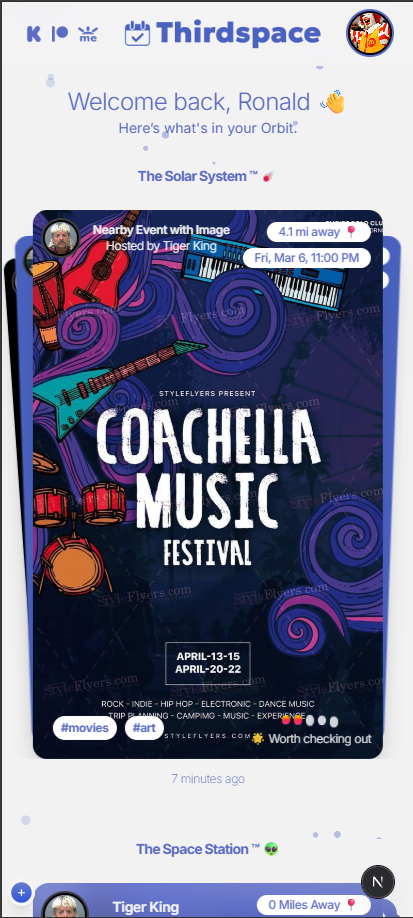 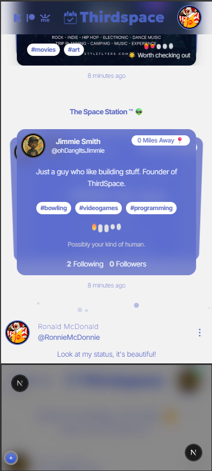 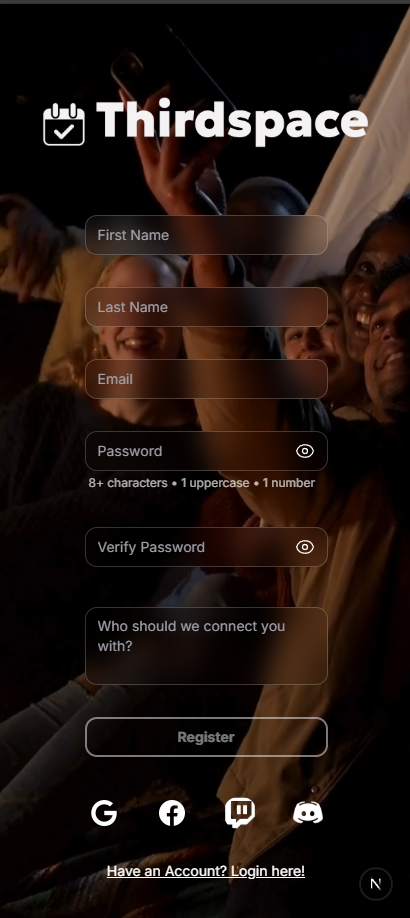

# Daily Update – ThirdSpace App (3/5/2026)

# Development Log – Feed Media & Discoverability Improvements

## Overview

Today's work focused on improving how media attachments are displayed throughout the platform feed and event discovery modules. The goal was to make posts with attachments more visually engaging while keeping layouts consistent across the application.

Several UI components were introduced or refactored, including a reusable attachment swiper card for feed items and improvements to event discoverability cards.

---

## Feed Attachment System

### FeedAttachmentSwiper Card

A new reusable card component was introduced for rendering attachments within feed posts.

Features:

- Uses **Swiper.js "cards" effect** for a stacked card browsing experience
- Supports **images and videos**
- Adds a **blurred background backdrop** derived from the attachment for visual depth
- Standardized media sizing and positioning across feed contexts
- Designed to work seamlessly within feed items that contain multiple attachments

This component will serve as the base attachment renderer for:

- Status posts
- Event posts
- Feed previews

---

## Event Discoverability Improvements

### Event Discoverability Card

Enhancements were made to the event discovery cards used in modules like:

- **Events Near You**
- **Solar System discovery module**

Key improvements:

- Swiper support for multiple event attachments
- Background media preview
- Consistent attachment handling across feed and discovery cards
- Event popularity "hype meter"
- Distance display (meters → miles conversion)

---

## Media Rendering Standardization

Images and videos now share a consistent layout strategy:

- `object-cover` for immersive previews
- `object-contain` when comments or overlays are present
- Uniform height handling across feed and event pages
- Consistent Tailwind height logic for feed contexts

This helps prevent layout shifting and keeps media visually balanced.

---

## Feed UI Refinements

Additional improvements to the feed experience:

- Improved attachment slide centering
- Fixed Swiper layout width issues
- Removed unexpected padding injected by Swiper defaults
- Cleaned up attachment container rendering logic
- Added styled description block for feed posts

---

## Bug Fixes

### Nested Swiper Interaction Issue

A nested swiper inside another swiper was unintentionally capturing click events, preventing navigation to event pages.

Resolution plan:

- Refactor **Solar System** and **Space Station** modules
- Ensure swipe gestures and click navigation behave correctly
- Prevent inner swiper elements from swallowing navigation events

---

## Upcoming Work

### Welcome Checklist Feed Post

The welcome post will be refactored into a checklist to help new users complete their profiles.

Planned items include:

- Add interest tags
- Review privacy settings
- Update username if needed
- Enable additional security features (2FA)

---

## Current Status

The feed system now supports:

- Rich attachment browsing
- Consistent media layouts
- Interactive card-based swiping
- Improved visual hierarchy for posts and events

These changes lay the groundwork for more engaging feed content and smoother discovery of events and users.

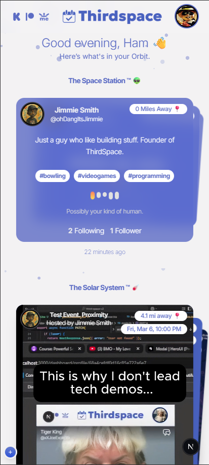 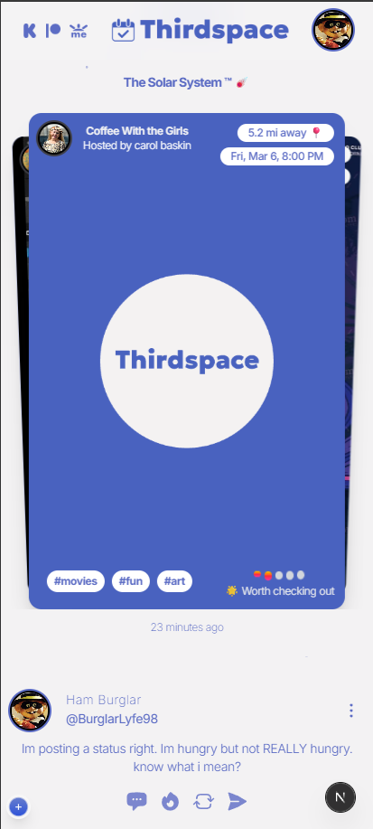 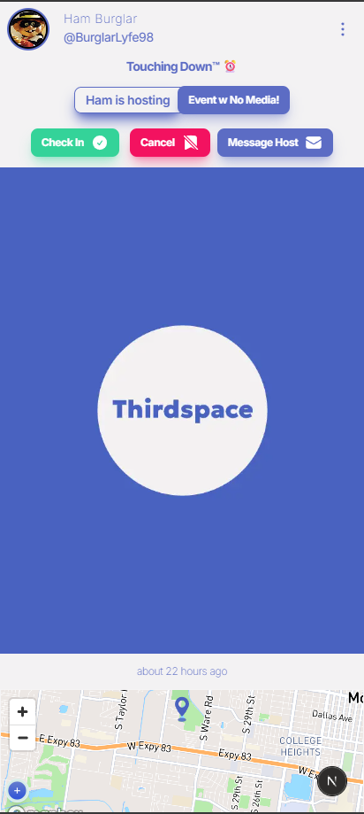 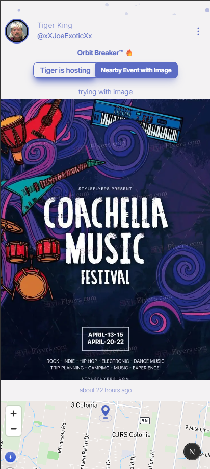

# Development Log — Karma System & Rank Promotions

## Overview

Today we implemented the full **karma reward and promotion system** powering user progression within the platform. This system awards karma for user actions, calculates rank promotions, and broadcasts those promotions through the activity feed while ensuring consistent UI updates across the app.

The work included backend infrastructure, feed synchronization, and frontend reactivity.

---

# Karma Reward Pipeline

A centralized utility function powers all karma rewards:

Actions currently awarding karma:

- Posting a status
- Adding a comment (non-reply and not on own status)

This function:

- Applies daily reward caps
- Returns the **awarded amount**
- Prevents exceeding configured limits

Example return payload:

```ts
{
  awarded: number;
}
```

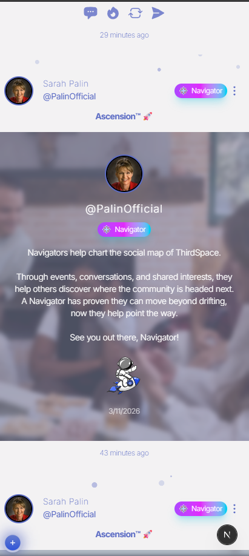!
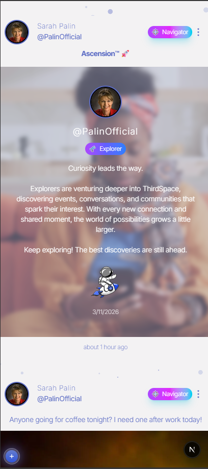!
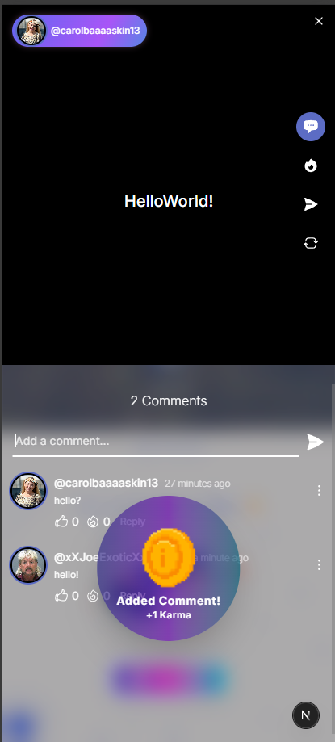!
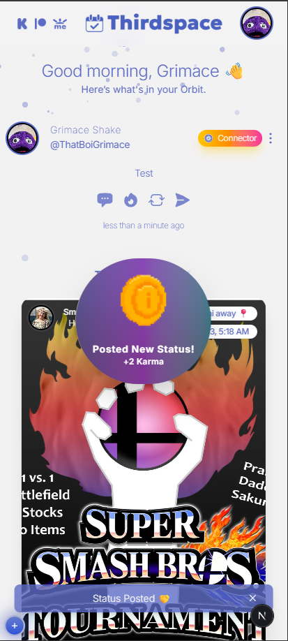;
